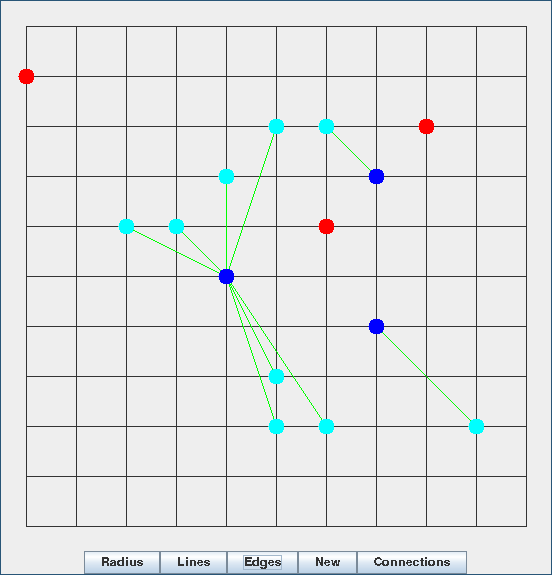
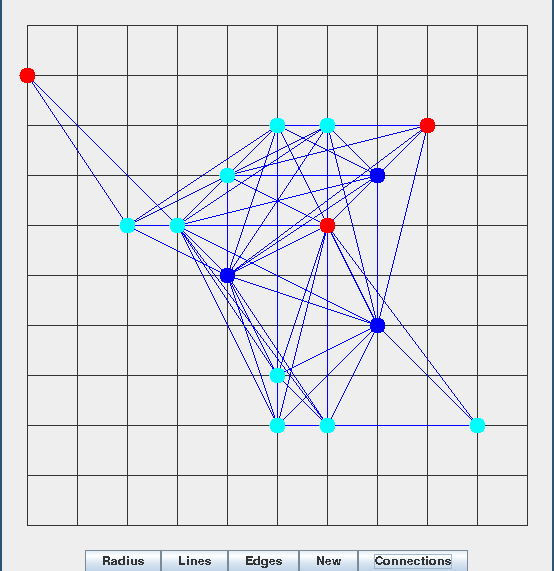
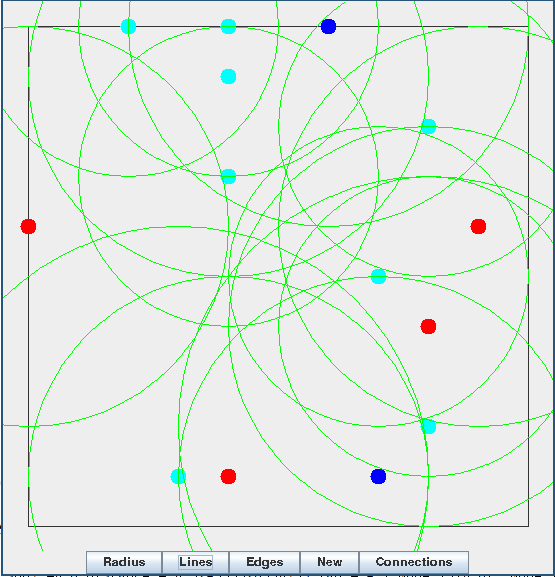

This is a application is to simulate a opertunisric network in action.

Link: http://en.wikipedia.org/wiki/Opportunistic_Mobile_Social_Networks

<blockquote>
"Unlike mobile ad hoc networks (MANETs) that require end-to-end communication paths for message exchange, the communication in opportunistic mobile social networks takes place on the establishment of opportunistic contacts among mobile nodes, without availability of end-to-end message routing paths."
</blockquote>

The enviroment is a area with multiple different cell phones trying to connect to each other through wifi. As time goes on, nodes will connect and disconnect to each other forming small networks that will pass on new messages or messages they got from other nodes. As this happens, messages should spead to all nodes in a viral manner.

- Red: 		Isolated Nodes
- Blue: 	Master Noes
- Cyan:		Nodes connected to Master nodes

Here is a Photo of all posible connections in the form of a graph

Each node has a connection radius. Any node within the radius, or if it is within someone elses raduis, can be connected to. The graph was built from these.

