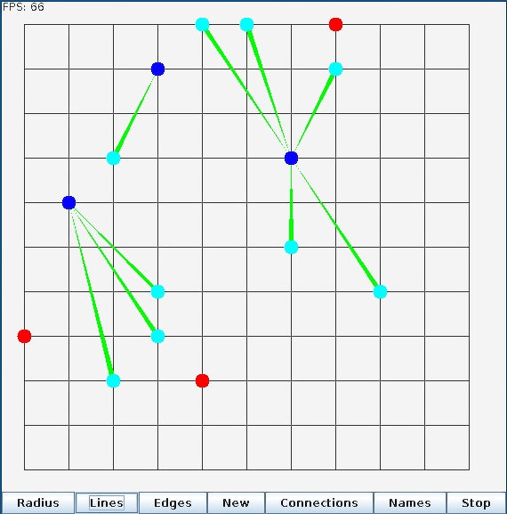
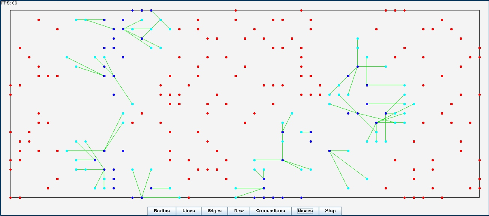

This is a application simulates a opertunistic network.

Link: http://en.wikipedia.org/wiki/Opportunistic_Mobile_Social_Networks

<blockquote>
"Unlike mobile ad hoc networks (MANETs) that require end-to-end communication paths for message exchange, the communication in opportunistic mobile social networks takes place on the establishment of opportunistic contacts among mobile nodes, without availability of end-to-end message routing paths."
</blockquote>

More information on the subject: https://code.google.com/p/social-tracer/wiki/OpportunisticNetworking

The idea I am trying to simulate is a situation where mobile phones have no other meens of communication (GSM is down, no WiFi), and the establishment of a opertunistic network could be benificial. Each cellphone would be a node in the network either acting as a router or a user of the network. As time goes on, nodes will connect and disconnect to each other forming small networks that will pass on new messages or messages they got from other nodes. At some point in time each node will get the chance to be either a roughter or user. As the network is dynamicaly changes, messages should spead to all nodes in a viral manner.

- Red: 		Isolated Nodes
- Blue: 	Master Noes
- Cyan:		Nodes connected to Master nodes

Here is a Photo of all posible connections in the form of a graph

Each node has a connection radius. Any node within the radius, or if it is within someone elses raduis, can be connected to. The graph was built from these.

The previos examples were small networks with 15 nodes. The program now supports a large version that has 150 nodes in the network.

